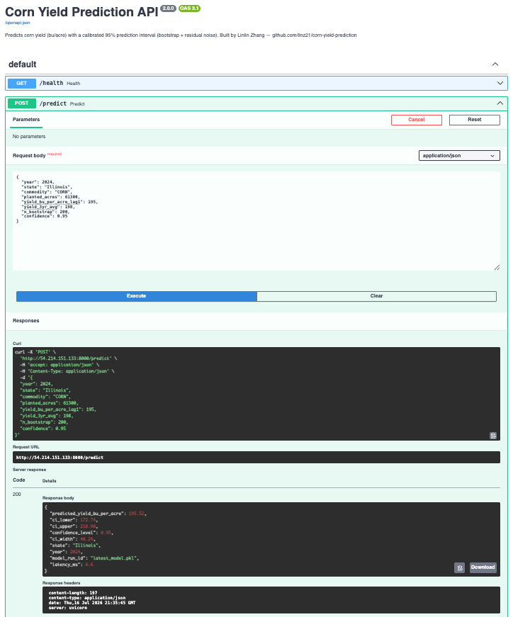

# 🌽 Corn Yield Prediction — Full MLOps Pipeline

**Author:** Linlin Zhang · [github.com/linz21](https://github.com/linz21)

A production-grade ML system that predicts US corn yield (bu/acre) with **Bayesian bootstrap confidence intervals**, full experiment tracking, drift monitoring, and CI/CD deployment.

## 🔗 Live Demo
Deployed on AWS EC2 with a permanent Elastic IP: **http://54.214.151.133:8000/docs**



Try a prediction:
```bash
curl -X POST http://54.214.151.133:8000/predict \
  -H "Content-Type: application/json" \
  -d '{"year": 2024, "state": "Illinois", "planted_acres": 61300, "yield_bu_per_acre_lag1": 195, "yield_3yr_avg": 198}'
```

> Note: this demo instance runs intermittently to manage cloud costs. If the link isn't responding, see [Quickstart](#quickstart) to run it locally.


## Architecture

```
USDA NASS API → Data Pipeline (DVC) → XGBoost 
                                            ↓
                                    MLflow Experiment Tracking
                                            ↓
                               FastAPI /predict (with 95% CI)
                                            ↓
                            Docker → GitHub Actions → AWS EC2
                                            ↓
                               Evidently AI Drift Monitor
```

## Quickstart

```bash
# 1. Clone and install
git clone https://github.com/linz21/corn-yield-prediction
cd corn-yield-prediction
pip install -r requirements.txt

# 2. Get data (demo — no API key needed)
python src/data/ingest.py --demo

# 3. Train model
python src/models/train.py

# 4. View experiments
mlflow ui   # → http://localhost:5000

# 5. Serve API
uvicorn src.api.main:app --reload   # → http://localhost:8000/docs
```

## Sample prediction with confidence interval

```bash
curl -X POST http://localhost:8000/predict \
  -H "Content-Type: application/json" \
  -d '{"year": 2024, "state": "Illinois", "precip_inches": 28.5, "temp_avg_f": 58.2}'
```

```json
{
  "predicted_yield_bu_per_acre": 198.4,
  "ci_lower": 183.1,
  "ci_upper": 213.7,
  "confidence_level": 0.95,
  "ci_width": 30.6,
  "latency_ms": 42.1
}
```

## Tech Stack

`XGBoost` · `MLflow` · `DVC` · `FastAPI` · `Pydantic` · `Evidently AI` · `Docker` · `GitHub Actions` · `AWS EC2`

## Results

| Metric | Value |
|--------|-------|
| Test RMSE | 13.6 bu/acre |
| Test R² | 0.900 |
| Test MAPE | 8.75% |
| CI Coverage (95%) | 94.1% |
| CI Width (mean) | 54.32 bu/acre |
| Model Inference Latency | ~3-7ms (server-side, from API response) |
| API Round-Trip Latency (p95) | 171.3ms (external, includes network) |
| Training rows | 21,290 (real USDA county-level data) |

## Known Limitations
- **Weather/soil features** (precipitation, temperature, soil pH) are only available in 
  synthetic demo data. Real USDA Quickstats data does not include these — would require 
  merging NOAA weather data and USDA NRCS soil survey data (planned for v2).
- **Harvested acreage** was excluded due to conflicting Survey vs Census values in USDA's 
  data with no reliable disambiguating field.

## Note on CI/CD
The GitHub Actions pipeline (`.github/workflows/ci.yml`) trains a quick model on 
synthetic demo data purely to verify the pipeline runs end-to-end 
(data → features → train → serve → Docker build). This keeps CI fast and 
independent of any API keys or credentials.

The production model referenced in the Results section below was trained 
separately on real USDA Quickstats data (30,416 rows, county-level, 
2000–2025) and is not what CI builds. To reproduce the real model locally:

```bash
python src/data/ingest.py --api-key YOUR_USDA_KEY
python src/features/build_features.py
python src/models/train.py --run-name "production-model"
```